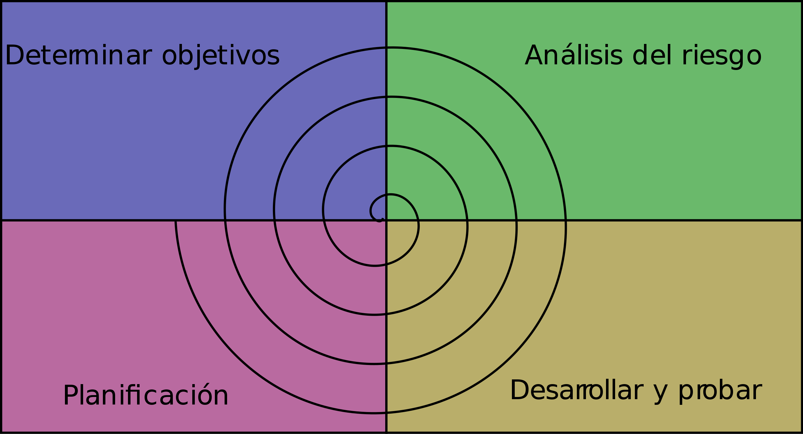

## Parte 1: Ingenieria de software
Una definicion formal de la ingenieria de software se puede encontrar en el [glosario de la ieee](https://ieeexplore.ieee.org/document/159342) donde se establece que:

>Software engineering is defined as the application of a systematic, disciplined, quantifiable approach to the development, operation, and maintenance of software.

Esta definicion establece que es la aplicacion de un proceso (o aproximacion) sistematico, disciplinado y cuantificable del desarrollo, operacion y mantenimiento del software. Lo importante en la frase anterior es `sistematico`, `disciplinado` y `cuantificable`, entonces explorando los tres terminos tenemos:
* `sistematico`: Que sigue o se ajusta a un sistema (conjunto ordenado de normas y procedimientos).
* `disciplinado`: Conjunto de reglas de comportamiento para mantener el orden y la subordinación entre los miembros de un cuerpo o una colectividad en una profesión o en una determinada colectividad.
* `cuantificable`: De la cantidad o relacionado con ella.

Entonces, volviendo a la definicion de ingenieria de software podemos entenderla como que es seguir las normas y procedimientos que nos dan un sentido y direccion en la construccion del software, teniendo en cuenta que todo debe ser medido o cuantificado en algun punto.

Si bien ya tenemos la definicion de lo que es la ingenieria del software, la misma definicion nos puede mostrar que todo en la construccion del software es guiado por un proceso y que el desarrollador es una parte del mismo. El ingeniero de software no solo tiene que escribir codigo que sea de buena calidad y mantenible, sino tambien tiene que pensar cosas como por ejemplo cuales son las reglas de negocio que se aplican, como se va a testear el codigo de modo que sea mantenible y automatizable, como se va a desplegar el codigo en un servidor, con que otros componentes de la arquitectura interactua y como responde el codigo escrito bajo estres?

En la ingenieria de software existen roles que soportan el proceso de definicion, construccion y prueba del mismo. El SDLC (software development life cycle) es como se describe el proceso complejo y con multiples fases y etapas con el que se desarrolla el software.

## SDLC
Como mencionamos en el apartado anterior, SDLC (softare development life cycle) se refiere al proceso complejo multifases que se utiliza para la construccion del sfotware, y como tambien establecimos antes, el ingeniero de software es un rol de este proceso que no solo escribe buen codigo. Dentro de SDLC existen otros roles:

- `SWE`: Software Engineer.
- `TAE`: Test Software Engineer.
- `SRE`: Site Reliability Engineer.
- `RE`: Release Engineer.
- `System Architect`: Architect.
  
### Software Engineer (SWE)
Este es un rol muy importante ya que es quien diseña y escribe las nuevas piezas de codigo que generan el software, aunque tambien es responsable de operar y mantener el software existente y el legado (legacy).

Los SWE se pueden categorizar segun su cantidad de experiencia en:

- `Junior`: Son aquellos que recien comienzan su carrera profesional y no poseen experiencia desarrollando software de produccion. Estos SWE son aquellos que aprenden mas de lo que aportan en una organizacion pero tambien son quienes van a desarrollar y operar software en un futuro no muy lejano.
- `Semi-Senior`: Tambien conocido como `mid-level`, es un SWE que cuenta con 2 o 3 años de experiencia desarrollando en empresas y con experiencia en desarrollos que son desplegados a produccion. Estos desarrolladores o ingenieros no solo escriben codigo sino que tambien pueden hacer criticas al codigo de otras personas y ayudar a los `juniors` con sus tareas tecnicas como asi tambien actuar como mentor de carrera. Los semi-senior conocen generalmente varias tareas del `SDLC`.
- `Senior`: Estos SWE conocen en profundidad muchas partes del `SDLC` y tienen habilidades de coordinacion de equipos, manejo de clientes, despliegues a produccion y sobre todo adquieren un nivel de entendimiento profundo sobre una industria o negocio lo que los hace una fuente de conocimiento para personal tecnico y no tecnico.

Tambien se puede clasificar a los SWE segun su expertise en ciertas capas del software. Otra forma seria entonces:

- `Frontend engineers`: Estos son aquellos que trabajan exclusivamente en las partes o componentes de la aplicacion (o software) que tiene interaccion con los usuarios, por ejemplo un mobile developer solo escribe codigo para aplicaciones que ejecutan en un celular (comunmente llamadas apps) o tambien un WebUI developer que puede escribir codigo para renderizar paginas web via un servidor.
- `Backend engineers`: Son aquellos que trabajan en las partes de la applicacion o software que ejecuta en los servidores y se encargan del almacenamiento, busqueda y devolucion de datos, logica de negocios y escalabilidad de la solucion.
- `full stack engineers`: Son aquellos que pueden trabajar en los dos anteriores sin problemas.

### Test Software Engineer (TAE)
Tambien conocido como Software Development Engineer in Test (`SDET`), el Test Automation Engineer es aquel developer que escribe codigo para probar y estresar el software que escribe el `SWE`. La mision de los `TAE` es velar porque el equipo de desarrollo (`SWE`) escriba cofigo de alta calidad y sin fallas.

Los `TAE` por definicion tienen como objetivo principal automatizar el testing, esto ayuda a repetir las pruebas y mantener la calidad constantemente. Para la automatizacion de las pruebas se utilizan Continuous Integration (`CI`) pipelines, que son basicamente una serie de pasos automaticos que usan los equipos de desarrollos para integrar sus cambios usando una serie de pasos automaticos. Cuando nos referimos a integrar cambios son aquellos cambios en el software que son testeables para luego integrar en produccion con algun release de la aplicacion.

Los testeos (tests) que los `TAE` escriben pueden ser test de aceptacion o test de performance, donde los primeros son para probar que una pieza de codigo haga correctamente lo que tiene que hacer y los segundos son para estresar y evaluar el comportamiento bajo estres, por ejemplo simular 2 millones de usuarios tratando de comprar algo.

### Site Reliability Engineer (SRE)
El Site Reliability Engineer conocido como `SRE` es aquel cuya mision es mantener los sistemas productivos en produccion sin contratiempos. El `SRE` es un software engineer que no solo desarrolla software sino tambien que opera sistemas productivos y en caso de fallas hace correcciones y/o crea incidencias (tickets/casos) con los equipos de soporte.

Es dogma de los `SRE` automatizar la mayor cantidad de tareas posibles evitando asi la intervencion humana y potencialmente fallas, para esto se utiliza Continuous Delivery (`CD`) pipelines que son herramientas de software que establecen pasos secuenciales y repetitivos que permiten desplegar software en servidores entre otras cosas.

### Release Engineer (RE)
Un release engineer es aquel que trabaja con todos los equipos necesarios para poder definir que comprende una version determinada del software a desplegar (release), esto comprende tareas de documentacion, escribir manuales y pasos para poder desplegar correctamente la solucion y tambien pasos para recuperar el sistema en caso de problemas.

### Architect
El arquitecto es un rol que usualmente se encuentra en grandes empresas mientras que en empresas mas pequeñas este rol lo ocupa un `swe` senior. Este rol es el encargado de ver el `big picture`, es decir, observa la el sistema desde un punto mas macro, toma decisiones de tecnologia, ve como se integran los diferentes componentes y es la guia tecnologica del resto de la organizacion. Generalmente un arquitecto tiene mas de 10 años de experiencia en una industria y tiene conocimiento de casi todos los roles del SDLC, algunos mas en profundidad que otros pero conoce muy bien el ciclo de desarrollo.

## Modelos de Desarrollo de Software
Como comentamos en la seccion anterior, el SDLC es un proceso complejo y multicapas. Existen muchas formas o metodologias para crear software que han aparecido durante años, en este apartado vamos a conocer las mas significativas.

### Waterfall (Cascada)
Fue creado por Winston Royce en 1970 y se usó durante mucho tiempo. Actualmente se usa en algunas industrias muy complejas y generalmente relacionadas con la construccion de hardware. En el desarrollo de software se lo considera obsoleto. El proceso consiste en una serie de pasos que son ejecutados en forma secuencial, donde el resultado de uno de las pasos es la entrada del proximo. Una simplificacion de los pasos es:

1. Recoleccion de requerimientos: Se entrevista al cliente para entender los requerimientos que dan origen al pedido del software. Como salida de este paso se genera un documento donde estan detallados esos requerimientos.
2. Diseño: Basado en el contenido del documento de requerimientos los analistas y arquitectos generan un documento de arquitectura que cumpla con esos requerimientos.
3. Implementacion: en este paso los desarrolladores (o `swe`) construyen lo que el diseño y arquitectura fue documentado en el paso anterior.
4. Verificacion: En este paso se realizan pruebas funcionales y no funcionales que determinan si el software resultante de la implementacion cumple con lo establecido en el documento de requerimientos.
5. Mantenimiento: Este paso es basicamente deployar (instalar) el software ya verificado en el paso anterior y comienza a ser operado por el cliente.

Un supuesto (assumption) es que **todos** los requerimientos son relevados y documentados en el paso 1, con lo cual lo que se construye en el paso 3 y entrega en el paso 5 esta establecido en los primero momentos del proceso. El problema de esto es que hoy en dia es **muy** esperable que haya cambios en los requerimientos desde que se relevan hasta que se entregan, por ejemplo, probablemente en el punto uno se haya relevado que para alquilar una casa usando un portal se debe pagar usando tarjeta de credito y para cuando se entrega el software se espera que se pague usando alguna otra plataforma como por ejemplo paypal, mercadopago o criptomonedas.

Si el tiempo que transcurre entre el punto 1 y el 4 es mucho, el sfotware que se construye ya es obsoleto.

### Mejora Continua (Iterative enhancement)
El modelo de mejora continua nace en 1975 propuesto por Basili y Victor. Este modelo es similar al anterior pero iterando un subconjunto de pasos. Este modelo aparece para reparar el problema de que en proyectos largo el modelo Waterfall falla debido a que entrega un producto que no cumple con las expectativas ya que los requerimientos cambian durante el proceso de construccion. Entonces, este nuevo modelo repite los pasos 1 a 4 (inclusive) hasta que la verificacion deja conforme a los clientes, luego de las iteraciones se ejecuta el ultimo paso, el 5. Entonces:

<pre>
 __
|  |
|  \/
| 1. Recoleccion de requerimientos 
| |
| 2. diseño
| |
| 3. implementacion
| |
| 4. verificacion
|_|
  |
  \/ 
5. Mantenimiento
</pre>

Esto favorece a que los requerimientos puedan cambiar ya que en las sucesivas iteraciones se van detectando los cambios (entrevistando a los clientes en el paso 1) y se puede modificar el documento de requerimientos y en cascada la implementacion y la verificacion. El problema que esto trae es que el cliente necesita mas presupuesto ya que seria como partir un proyecto grande en varios proyectos medianos porque siguen siendo casi un waterfall completo por cada iteracion. Sigue sin ser lo suficientemente **agil**.

### Espiral (Spiral)
Luego de Waterfall y Mejora Continua vino el modelo de espiral creado por Barry Boehm en 1986. No vamos a explicar en detalle este modelo para poder ir al modelo mas utilizado hoy en dia pero para dejar una idea del mismo, Boehm establece que el model espiral es un modelo dirigido por los riesgos y va incrementalmente añadiendo funcionalidad al alcance del desarrollo o producto, pero simpre monitoreando los riesgos. Este modelo aparece porque aun con el modelo de mejora continua, los proyecto grandes se pasaban en presupuesto o en tiempo y desembocaban en un fracaso. Para mayor detalle dejo este [link](https://es.wikipedia.org/wiki/Desarrollo_en_espiral). Visto en un diagrama seria:

Algo importante a destacar es que las actividades de cada uno de los cuadrantes no son fijas, se definen los que estan haciendo el proyecto y tambien que cada etapa o actividad nace del analisis de riesgo de la etapa anterior.

### Agil (Agile)
El desarrollo agil es una especie de paraguas que contiene varias metodologias, frameworks (marcos de trabajo) y mejores practicas que ayudan a desarrollar software en una forma mas adecuada a la velocidad de cambios de requerimientos, presupuestos y equipos. Para mas informacion se puede leer la definicion en [agilealliance.org](https://www.agilealliance.org/agile101). Podemos decir que:

>El desarrollo ágil aboga por la creación de software de forma incremental iterando en ciclos múltiples, aunque relativamente cortos. Los requerimientos son desarrollados por equipos con roles determinados y auto gestionados, fomentando la colaboracion entre los distintos miembros.

Agile es basicamente un manifesto que establece lo que detallamos en el parrafo anterior y dio lugar a muchas metodologias que iremos explorando a continuacion.

#### Lean 
Lean es uno de los primero en la familia de agile, este aparece en 2003. Este modelo de desarrollo de software se basa en los siguientes puntos:

1. **Eliminar basura**: todo aquello que no sea de valor para el producto final debe ser eliminado. Por ejemplo: funcionalidad nice-to-have es decir, aquella funcionalidad que si no esta no afecta al negocio del proyecto, el exceso de reuniones que afectan el foco o tiempos de produccion de un equipo (burocracia!!), etc.
2. **creacion de conocimiento**: parte importante de lean y de agile en general es que los requerimientos relevados del cliente generalmente estan incompletos o van a cambiar en el tiempo entonces los miembros del equipo de desarrollo tienen que tener estrategias para recibir esos cambios de scope (alcance de los requerimientos) sin afectar por demas al equipo o el desarrollo. El equipo de desarrollo de agile es un equipo auto gestionado y al trabajar directamente con el cliente ira entendiendo el negocio (basicamente lo que se esta creando desde el punto de vista del cliente). Este conocimiento se va acumulando y es de vital importancia que se comparta con otros equipos, siendo asi el equipo de desarrollo mismo una fuente de conocimiento.
3. **Diferir decisiones**: Se trata de evitar aquello que waterfall tenia como primer paso, es decir, tener el total de las definiciones antes de desarrollar. Esto quiere decir que se comienza a desarrollar sin tener los requerimientos 100% relevados y por ende vendran cambios.
4. **Construir basado en calidad**: Dado que los bug o errores afectan mucho la velocidad de los equipos, lean y agile en general trata de evitarlos usando estrategias de desarrollo como TDD (Test Driven Development) que consiste en escribir un test unitario antes de escribir una funcion. La calidad del codigo genera mucha solidez en el producto y evita retrabajo o perdida de tiempos innecesarios (esto es el punto 1 de lean).
5. **Entregas rapidas**: Entregar rapidamente aquello con lo que uno esta trabajando nos da la oportunidad de que el cliente pueda evaluar si estamos en el camino correcto y esto es super valorado por ellos. Esto ahorra tiempo en retrabajo, ahorra presupuesto y maneja las expectativas del cliente. Recuerden que los requerimientos no estan 100% relevados y pueden cambiar, en este contexto entregar rapido es clave.
6. **Respetar y empoderar a los miembros del equipo**: Lean establece que el desarrollo se hace con equipos chicos y que son auto gestionados. En este contexto es de vital importancia evitar distracciones y mantener el equipo haciendo foco en la mision y el desrrollo, dandole el empoderamiento de tomar decisiones y evitando el micro-management que es cuando una persona esta constantemente controlando y pidiendo reportes de progreso a los developers.
7. **Optimizar el todo**: El proceso de desarrollo de una organizacion debe ser visto como un proceso interconectado de actividades y debe ser optimizado como un todo. Las organizaciones comunmente se dejan llevar por otros de los puntos de lean como por ejmplo entregas rapidas y focalizan toda la optimizacion en un solo aspecto y no en todo el proceso de desarrollo llevando a la suboptimizacion del proceso o incluso a problemas peores. Un ejemplo comun es optimizar las entregas rapidas y esto genera que el equipo potencialmente genere codigo complejo y con errores que en el tiempo se van acumulando y haciendo cada vez mas complejos hasta el punto de que no se pueden resolver o el retrabajo es inmenso. Esto generalmente ocurre cuando no solo se le pide al equipo que entregue rapido sino tambien que no vaje la velocidad de produccion, no pudiendo atender calidiad.

#### SCRUM

#### KANBAN

#### Otros
Existen otros modelos de desarrollo de software mas modernos que los anteriores como por ejemplo DevOps que utiliza a su vez otro llamado CAMS (Culture, Automation, Measurement and Sharing) y otros mas. Estos modelos usan el principio que cada equipo es responsable por el servicio o componente que estan desarrollando desde el entendimiento del alcance (scope), la implementacion, despliegue en produccion y monitores post produccion, basicamente todo lo que implica ese servicio o componente. Se pueden encontrar detalles en este [link](https://en.wikipedia.org/wiki/DevOps) y este [otro](https://medium.com/@raycad.seedotech/devops-methodology-and-process-dde388eb65bd).