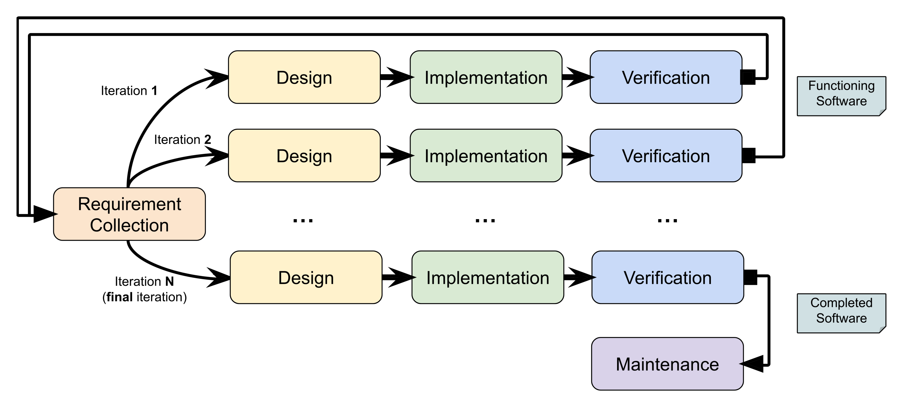
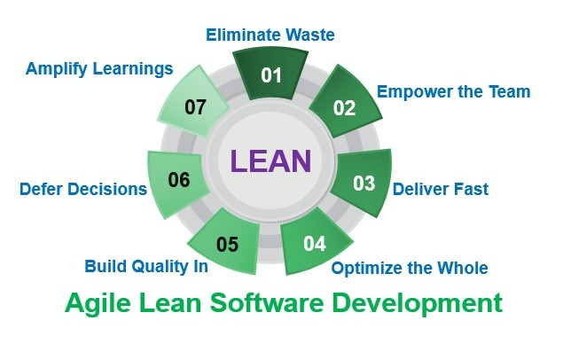
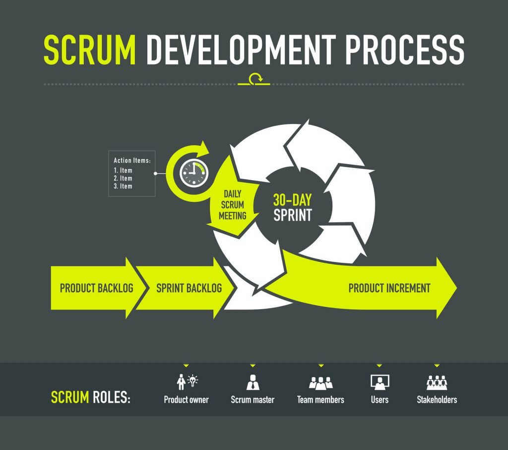
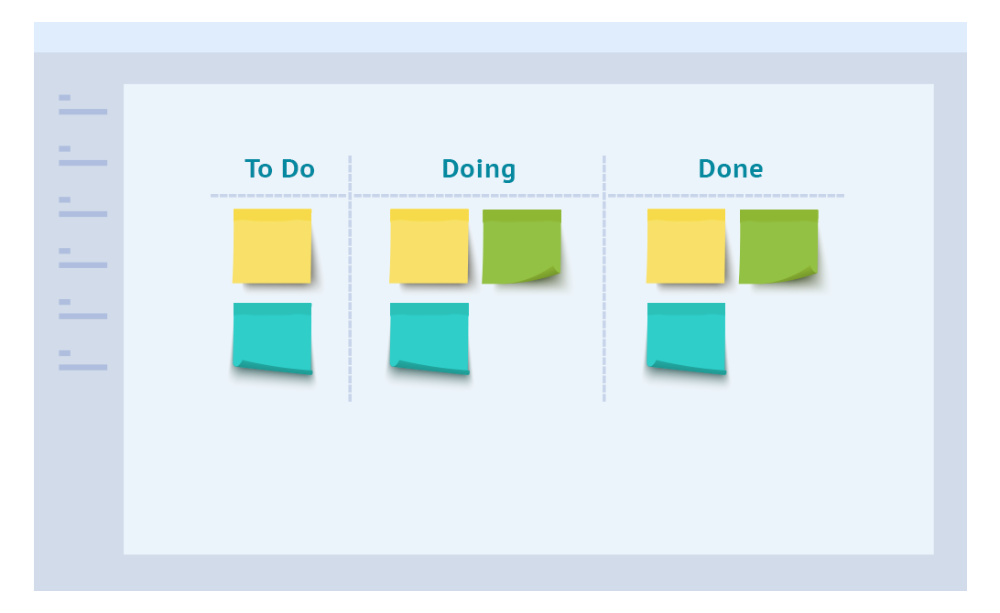

# Seminario de Introduccion a la Ingenieria y Desarrollo de Software

## Objetivo
El objetivo del presente seminario de introducción a la ingeniería y desarrollo de software tiene como principal objetivo explicar que es la ingeniería de software y cómo desarrollar software backend. Para la práctica del seminario se utilizara el lenguaje golang.

## Prerrequisitos
Se requiere tener conocimientos básicos de desarrollo de software en algún lenguaje de programación.

## Organización
El seminario se organizará en tres partes:

* Conceptos de ingeniería de software
* Desarrollo backend con Golang
* Trabajo práctico final entregable y obligatorio

El seminario cuenta con aproximadamente 3 horas semanales, prácticas y cuestionarios a desarrollar offline en la semana.

## Parte 1: Ingeniería de software
Una definición formal de la ingeniería de software se puede encontrar en el [glosario de la ieee](https://ieeexplore.ieee.org/document/159342) donde se establece que:

```
Software engineering is defined as the application of a systematic, disciplined, quantifiable approach to the development, operation, and maintenance of software.
```

Esta definición establece que es la aplicación de un proceso (o aproximación) sistemático, disciplinado y cuantificable del desarrollo, operación y mantenimiento del software. Lo importante en la frase anterior es sistemático, disciplinado y cuantificable, entonces explorando los tres términos tenemos:

* `sistemático`: Que sigue o se ajusta a un sistema (conjunto ordenado de normas y procedimientos).
* `disciplinado`: Conjunto de reglas de comportamiento para mantener el orden y la subordinación entre los miembros de un cuerpo o una colectividad en una profesión o en una determinada colectividad.
* `cuantificable`: De la cantidad o relacionado con ella.

Entonces, volviendo a la definición de ingeniería de software podemos entenderla como que es seguir las normas y procedimientos que nos dan un sentido y dirección en la construcción del software, teniendo en cuenta que todo debe ser medido o cuantificado en algún punto.
Si bien ya tenemos la definición de lo que es la ingeniería del software, la misma definición nos puede mostrar que todo en la construcción del software es guiado por un proceso y que el desarrollador es una parte del mismo. El ingeniero de software no solo tiene que escribir código que sea de buena calidad y mantenible, sino también tiene que pensar cosas como por ejemplo cuáles son las reglas de negocio que se aplican, como se va a testear el código de modo que sea mantenible y automatizable, como se va a desplegar el código en un servidor, con qué otros componentes de la arquitectura interactúa y cómo responde el código escrito bajo estrés?
En la ingeniería de software existen roles que soportan el proceso de definición, construcción y prueba del mismo. El SDLC (software development life cycle) es como se describe el proceso complejo y con múltiples fases y etapas con el que se desarrolla el software.

## SDLC
Como mencionamos en el apartado anterior, SDLC (software development life cycle) se refiere al proceso complejo multifases que se utiliza para la construcción del software, y como también establecimos antes, el ingeniero de software es un rol de este proceso que no solo escribir buen código. Dentro de SDLC existen otros roles:

* `SWE`: Software Engineer.
* `TAE`: Test Software Engineer.
* `SRE`: Site Reliability Engineer.
* `RE`: Release Engineer.
* `System Architect`: Architect.

### Software Engineer (SWE)
Este es un rol muy importante ya que es quien diseña y escribe las nuevas piezas de código que generan el software, aunque también es responsable de operar y mantener el software existente y el legado (legacy).

Los SWE se pueden categorizar según su cantidad de experiencia en:

* `Junior`: Son aquellos que recién comienzan su carrera profesional y no poseen experiencia desarrollando software de producción. Estos SWE son aquellos que aprenden más de lo que aportan en una organización pero también son quienes van a desarrollar y operar software en un futuro no muy lejano.

* `Semi-Senior`: También conocido como mid-level, es un SWE que cuenta con 2 o 3 años de experiencia desarrollando en empresas y con experiencia en desarrollos que son desplegados a producción. Estos desarrolladores o ingenieros no solo escriben código sino que también pueden hacer críticas al código de otras personas y ayudar a los juniors con sus tareas técnicas como así también actuar como mentor de carrera. Los semi-senior conocen generalmente varias tareas del SDLC.

* `Senior`: Estos SWE conocen en profundidad muchas partes del SDLC y tienen habilidades de coordinación de equipos, manejo de clientes, despliegues a producción y sobre todo adquieren un nivel de entendimiento profundo sobre una industria o negocio lo que los hace una fuente de conocimiento para personal técnico y no técnico.

También se puede clasificar a los SWE según su expertise en ciertas capas del software. Otra forma sería entonces:

* `Frontend engineers`: Estos son aquellos que trabajan exclusivamente en las partes o componentes de la aplicación (o software) que tiene interacción con los usuarios, por ejemplo un mobile developer solo escribe código para aplicaciones que ejecutan en un celular (comúnmente llamadas apps) o también un Web UI developer que puede escribir código para renderizar páginas web vía un servidor.

* `Backend engineers`: Son aquellos que trabajan en las partes de la aplicación o software que ejecuta en los servidores y se encargan del almacenamiento, búsqueda y devolución de datos, lógica de negocios y escalabilidad de la solución.

* `Full stack engineers`: Son aquellos que pueden trabajar en los dos anteriores sin problemas.

### Test Software Engineer (TAE)
También conocido como Software Development Engineer in Test (SDET), el Test Automation Engineer es aquel developer que escribe código para probar y estresar el software que escribe el SWE. La misión de los TAE es velar porque el equipo de desarrollo (SWE) escriba código de alta calidad y sin fallas.

Los TAE por definición tienen como objetivo principal automatizar el testing, esto ayuda a repetir las pruebas y mantener la calidad constantemente. Para la automatización de las pruebas se utilizan Continuous Integration (CI) pipelines, que son básicamente una serie de pasos automáticos que usan los equipos de desarrollos para integrar sus cambios usando una serie de pasos automáticos. Cuando nos referimos a integrar cambios son aquellos cambios en el software que son testeables para luego integrar en producción con algún release de la aplicación.
Los testeos (tests) que los TAE escriben pueden ser test de aceptación o test de performance, donde los primeros son para probar que una pieza de código haga correctamente lo que tiene que hacer y los segundos son para estresar y evaluar el comportamiento bajo estrés, por ejemplo simular 2 millones de usuarios tratando de comprar algo.

### Site Reliability Engineer (SRE)
El Site Reliability Engineer conocido como SRE es aquel cuya misión es mantener los sistemas productivos en producción sin contratiempos. El SRE es un software engineer que no solo desarrolla software sino también que opera sistemas productivos y en caso de fallas hace correcciones y/o crea incidencias (tickets/casos) con los equipos de soporte.

Es dogma de los SRE automatizar la mayor cantidad de tareas posibles evitando así la intervención humana y potencialmente fallas, para esto se utiliza Continuous Delivery (CD) pipelines que son herramientas de software que establecen pasos secuenciales y repetitivos que permiten desplegar software en servidores entre otras cosas.

### Release Engineer (RE)
Un release engineer es aquel que trabaja con todos los equipos necesarios para poder definir que comprende una versión determinada del software a desplegar (release), esto comprende tareas de documentación, escribir manuales y pasos para poder desplegar correctamente la solucion y tambien pasos para recuperar el sistema en caso de problemas.

### Software Architect
El arquitecto es un rol que usualmente se encuentra en grandes empresas mientras que en empresas más pequeñas este rol lo ocupa un swe senior. Este rol es el encargado de ver el big picture, es decir, observa el sistema desde un punto más macro, toma decisiones de tecnología, ve cómo se integran los diferentes componentes y es la guía tecnológica del resto de la organización. Generalmente un arquitecto tiene más de 10 años de experiencia en una industria y tiene conocimiento de casi todos los roles del SDLC, algunos más en profundidad que otros pero conoce muy bien el ciclo de desarrollo.

## Modelos de Desarrollo de Software
Como comentamos en la sección anterior, el SDLC es un proceso complejo y multicapas. Existen muchas formas o metodologías para crear software que han aparecido durante años, en este apartado vamos a conocer las más significativas.

### Waterfall (Cascada)
Fue creado por Winston Royce en 1970 y se usó durante mucho tiempo. Actualmente se usa en algunas industrias muy complejas y generalmente relacionadas con la construcción de hardware. En el desarrollo de software se lo considera obsoleto. El proceso consiste en una serie de pasos que son ejecutados en forma secuencial, donde el resultado de uno de los pasos es la entrada del próximo. Una simplificación de los pasos es:

* `Recolección de requerimientos`: Se entrevista al cliente para entender los requerimientos que dan origen al pedido del software. Como salida de este paso se genera un documento donde están detallados esos requerimientos.

* `Diseño`: Basado en el contenido del documento de requerimientos los analistas y arquitectos generan un documento de arquitectura que cumpla con esos requerimientos.

* `Implementación`: en este paso los desarrolladores (o swe) construyen lo que el diseño y arquitectura fue documentado en el paso anterior.

* `Verificación`: En este paso se realizan pruebas funcionales y no funcionales que determinan si el software resultante de la implementación cumple con lo establecido en el documento de requerimientos.

* `Mantenimiento`: Este paso es básicamente deployar (instalar) el software ya verificado en el paso anterior y comienza a ser operado por el cliente.

<p align="center">

</p>

Un supuesto (assumption) es que todos los requerimientos son relevados y documentados en el paso 1, con lo cual lo que se construye en el paso 3 y entrega en el paso 5 está establecido en los primero momentos del proceso. El problema de esto es que hoy en dia es muy esperable que haya cambios en los requerimientos desde que se relevan hasta que se entregan, por ejemplo, probablemente en el punto uno se haya relevado que para alquilar una casa usando un portal se debe pagar usando tarjeta de crédito y para cuando se entrega el software se espera que se pague usando alguna otra plataforma como por ejemplo paypal, mercadopago o criptomonedas.

Si el tiempo que transcurre entre el punto 1 y el 4 es mucho, el software que se construye ya es obsoleto.

### Mejora Continua (Iterative enhancement)
El modelo de mejora continua nace en 1975 propuesto por Basili y Victor. Este modelo es similar al anterior pero iterando un subconjunto de pasos. Este modelo aparece para reparar el problema de que en proyectos largos el modelo Waterfall falla debido a que entrega un producto que no cumple con las expectativas ya que los requerimientos cambian durante el proceso de construcción. Entonces, este nuevo modelo repite los pasos 1 a 4 (inclusive) hasta que la verificación deja conforme a los clientes, luego de las iteraciones se ejecuta el último paso, el 5. Entonces:

<p align="center">

</p>

Esto favorece a que los requerimientos puedan cambiar ya que en las sucesivas iteraciones se van detectando los cambios (entrevistando a los clientes en el paso 1) y se puede modificar el documento de requerimientos y en cascada la implementación y la verificación. El problema que esto trae es que el cliente necesita más presupuesto ya que sería como partir un proyecto grande en varios proyectos medianos porque siguen siendo casi un waterfall completo por cada iteración. Sigue sin ser lo suficientemente ágil.

### Espiral (Spiral)
Luego de Waterfall y Mejora Continua vino el modelo de espiral creado por Barry Boehm en 1986. No vamos a explicar en detalle este modelo para poder ir al modelo más utilizado hoy en dia pero para dejar una idea del mismo, Boehm establece que el modelo espiral es un modelo dirigido por los riesgos y va incrementalmente añadiendo funcionalidad al alcance del desarrollo o producto, pero siempre monitoreando los riesgos. Este modelo aparece porque aun con el modelo de mejora continua, los proyecto grandes se pasaban en presupuesto o en tiempo y desembocaban en un fracaso. Para mayor detalle dejo este [link](https://es.wikipedia.org/wiki/Desarrollo_en_espiral). Visto en un diagrama sería:

<p align="center">

</p>

Algo importante a destacar es que las actividades de cada uno de los cuadrantes no son fijas, se definen los que están haciendo el proyecto y también que cada etapa o actividad nace del análisis de riesgo de la etapa anterior.

### Agil (Agile)
El desarrollo ágil es una especie de paraguas que contiene varias metodologías, frameworks (marcos de trabajo) y mejores prácticas que ayudan a desarrollar software en una forma más adecuada a la velocidad de cambios de requerimientos, presupuestos y equipos. Para más información se puede leer la definición en [agilealliance.org](https://www.agilealliance.org/agile101).

Podemos decir que:

```
El desarrollo ágil va en favor de la creación de software de forma incremental iterando en ciclos múltiples, aunque relativamente cortos. Los requerimientos son desarrollados por equipos con roles determinados y auto gestionados, fomentando la colaboración entre los distintos miembros.
```

Agile es básicamente un manifiesto que establece lo que detallamos en el párrafo anterior y dio lugar a muchas metodologías que iremos explorando a continuación.

#### Lean
Lean es uno de los primeros en la familia de agile, este aparece en 2003. Este modelo de desarrollo de software se basa en los siguientes puntos:

* `Eliminar basura`: todo aquello que no sea de valor para el producto final debe ser eliminado. Por ejemplo: funcionalidad nice-to-have es decir, aquella funcionalidad que si no está no afecta al negocio del proyecto, el exceso de reuniones que afectan el foco o tiempos de producción de un equipo (burocracia!!), etc.

* `Creación de conocimiento`: parte importante de lean y de agile en general es que los requerimientos relevados del cliente generalmente están incompletos o van a cambiar en el tiempo entonces los miembros del equipo de desarrollo tienen que tener estrategias para recibir esos cambios de scope (alcance de los requerimientos) sin afectar por demás al equipo o el desarrollo. El equipo de desarrollo de agile es un equipo auto gestionado y al trabajar directamente con el cliente irá entendiendo el negocio (básicamente lo que se está creando desde el punto de vista del cliente). Este conocimiento se va acumulando y es de vital importancia que se comparta con otros equipos, siendo así el equipo de desarrollo mismo una fuente de conocimiento.

* `Diferir decisiones`: Se trata de evitar aquello que waterfall tenía como primer paso, es decir, tener el total de las definiciones antes de desarrollar. Esto quiere decir que se comienza a desarrollar sin tener los requerimientos 100% relevados y por ende vendrán cambios.

* `Construir basado en calidad`: Dado que los bug o errores afectan mucho la velocidad de los equipos, lean y agile en general trata de evitarlos usando estrategias de desarrollo como TDD (Test Driven Development) que consiste en escribir un test unitario antes de escribir una función. La calidad del código genera mucha solidez en el producto y evita retrabajo o pérdida de tiempos innecesarios (esto es el punto 1 de lean).

* `Entregas rápidas`: Entregar rápidamente aquello con lo que uno está trabajando nos da la oportunidad de que el cliente pueda evaluar si estamos en el camino correcto y esto es super valorado por ellos. Esto ahorra tiempo en retrabajo, ahorra presupuesto y maneja las expectativas del cliente. Recuerden que los requerimientos no están 100% relevados y pueden cambiar, en este contexto entregar rápido es clave.

* `Respetar y empoderar a los miembros del equipo`: Lean establece que el desarrollo se hace con equipos chicos y que son auto gestionados. En este contexto es de vital importancia evitar distracciones y mantener el equipo haciendo foco en la misión y el desarrollo, dándole el empoderamiento de tomar decisiones y evitando el micromanagement que es cuando una persona está constantemente controlando y pidiendo reportes de progreso a los desarrolladores.

* `Optimizar el todo`: El proceso de desarrollo de una organización debe ser visto como un proceso interconectado de actividades y debe ser optimizado como un todo. Las organizaciones comúnmente se dejan llevar por otros de los puntos de lean como por ejemplo entregas rápidas y focalizan toda la optimización en un solo aspecto y no en todo el proceso de desarrollo llevando a la sub optimización del proceso o incluso a problemas peores. Un ejemplo común es optimizar las entregas rápidas y esto genera que el equipo potencialmente genere código complejo y con errores que en el tiempo se van acumulando y haciendo cada vez más complejos hasta el punto de que no se pueden resolver o el retrabajo es inmenso. Esto generalmente ocurre cuando no solo se le pide al equipo que entregue rápido sino también que no baje la velocidad de producción, no pudiendo atender la calidad.

<p align="center">

</p>

### SCRUM
Scrum es la metodología ágil más usada hoy en la industria, se utiliza tanto que incluso hay empresas que viven de dar cursos y certificaciones de scrum. Scrum se usa en proyectos largos donde el trabajo a realizar se puede cortar o separar en porciones a desarrollar por un equipo multifuncional durante unas pocas semanas (2 a 4). Un sprint es una porción de trabajo hecha en ese periodo de tiempo.

A diferencia de las metodologías vistas hasta el momento, scrum se concentra en un ciclo empírico repetitivo y no en un proceso bien definido a seguir. Básicamente el equipo recibe un volumen de trabajo a desarrollar en un sprint, entonces se genera una idea o plan de cómo desarrollarlo y se pone en práctica durante el sprint. Una vez finalizado el sprint el equipo hace una análisis de cómo mejorar esa idea o plan. Con las sucesivas iteraciones el equipo aprende a comunicarse y auto gestionarse como así también a hacer foco en el desarrollo dado que al haber mejor comunicación hay menos distracciones. Los equipos generalmente observan que mejoran en rendimiento y esto es conocido como velocidad del equipo o en la jerga de agile, team velocity.

Todos los miembros de los equipos que usan scrum pueden ser mapeados a los siguientes roles:

* `Product Owner` (PO)
* `Desarrollador` (Developer)
* `Scrum Master` (SM)

El product owner es el encargado de manejar el backlog, que es una lista de tareas a desarrollar, es el responsable de que las tareas que forman parte del backlog estén escritas de forma que sean claras, consistentes, sin ambigüedades. El backlog es una lista de tareas de naturaleza dinámica, no se debe asumir que lo que está en el backlog no va a cambiar en los sucesivos sprints.

El equipo de desarrollo, como se dijo antes, es un equipo multifuncional, es decir, es un equipo que está compuesto por integrantes que vienen de diferentes disciplinas y habilidades (skills). El equipo debe tener el mindset (mentalidad) de equipo y no de individuos, esto es, si alguien falla el equipo completo falla.
El scrum master es un rol que da soporte tanto al development team como al product owner. Este rol es el responsable de que todos tengan un entendimiento claro de los procesos de scrum como así también de las ceremonias (reuniones). Las ceremonias de scrum son básicamente:

* `Dailies` / `stand up`
* `Plannings`
* `Retrospectives`

La daily meeting o stand up es una ceremonia corta y diaria en la cual los participantes responde 3 preguntas básicas:

- En que estuve trabajando ayer
- En que voy a trabajar hoy
- ¿Tengo algún blocker?

Dar visibilidad de lo que uno hace e hizo al resto del equipo ayuda a que el resto del equipo se involucre y en el caso de existir bloqueos probablemente se resuelvan con reuniones posteriores o con la simple opinión del equipo. Las dailies son reuniones que generalmente son al inicio del día. Estas reuniones son rápidas y concretas, no se debe profundizar en temas y cuando se generan discusiones o se extiende un tema en particular el scrum master debe cortar la discusión y así no retrasar a todo el equipo. 

Las plannings son reuniones donde el equipo hablar con el scrum master para entender el scope o alcance del sprint. En esta reunión el equipo se compromete a desarrollar un volumen de trabajo determinado para el próximo sprint y por lo tanto es clave que se evacuen todas las dudas y se estime el esfuerzo que requiere cada una de las tareas, de este modo se puede incluir o dejar fuera del sprint alguna tarea en particular. 

Por último están las reuniones de retrospectiva (retrospectives) donde el equipo (y solo el equipo) habla de lo que se hizo bien en el sprint, lo que se podría mejorar y se detallan algunas acciones concretas para que no vuelva a ocurrir.

<p align="center">

</p>

Para más información se puede comenzar por [scrum en la wikipedia](https://es.wikipedia.org/wiki/Scrum_(desarrollo_de_software)).

### KANBAN
Kanban es otro framework popular de agile. Kanban se basa en el kanban board que es básicamente una distribución de tareas en una líneas de trabajo verticales en las que se detalla un estado en particular.

Como dijimos en el párrafo anterior, el kanban board se compone de work lanes (columnas de trabajo) con un label (título) asociado y una lista de tareas con un orden determinado. La transición entre columnas o work lanes es básicamente como van cambiando de estado las tareas y al ser finalizadas se las quita del board comúnmente archivandolas. Usualmente los work lanes son:

* `Backlog`: contiene la lista de tareas a realizar y es desde donde se toman las tareas.
* `Doing`: aca estan las tareas (con un owner o responsable) que se estan desarrollando.
* `Review`: en esta columna aparecen las tareas que estan terminadas pero a la espera de un testeo o review por parte de otros integrantes del equipo.
* `Done`: aca estan las tareas terminadas

En algunos equipos hay variaciones en las que se agregan columnas, por ejemplo "QA", "blocked" etc. Generalmente un developer que no tiene asignaciones concretas toma una tarea del backlog y la pone en doing mientras le agrega diariamente status u horas trabajadas, cuando la termina pasa esta tarea a review para hacer un testeo funcional con algún otro miembro del equipo y una vez que esta lista y deployada se la pasa a done.

<p align="center">

</p>

Para más información se puede comenzar a leer desde la [wikipedia](https://es.wikipedia.org/wiki/Kanban_Tool).

### Otros
Existen otros modelos de desarrollo de software más modernos que los anteriores como por ejemplo DevOps que utiliza a su vez otro llamado CAMS (Culture, Automation, Measurement and Sharing) y otros más. Estos modelos usan el principio que cada equipo es responsable por el servicio o componente que están desarrollando desde el entendimiento del alcance (scope), la implementación, despliegue en producción y monitores post producción, básicamente todo lo que implica ese servicio o componente. Se pueden encontrar detalles en este link y este otro.


